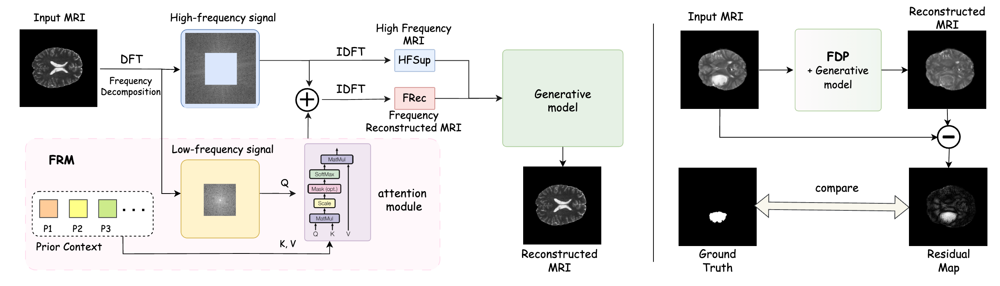
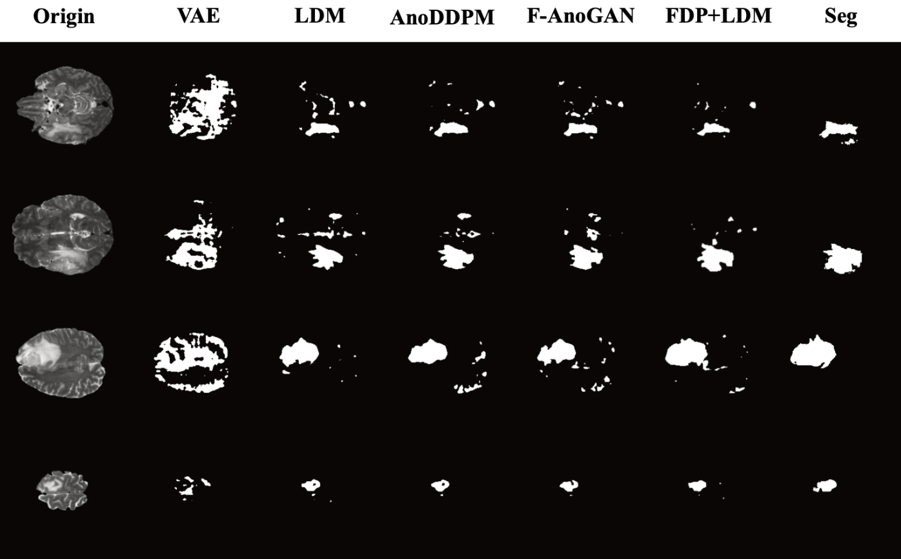

# MRI_FDP
FDP: A Frequency-Decomposition Preprocessing Pipeline for Unsupervised Anomaly Detection in Brain MRI


Frequency-Decomposition Pre-processing (FDP) - a modular component that eliminates pathologies through anatomically consistent low-frequency reconstruction while retaining diagnostically vital high-frequency details. This plug-and-play module could directly enhances existing anomaly simulation methods through its unique capability to separate and process pathological signatures in the frequency domain, significantly improving the quality of synthesized healthy MRIs without requiring modifications to downstream pipeline architectures.

## Datasets
Experiments are conducted on these public datasets:
* [IXI](https://brain-development.org/ixi-dataset/)
* [BRATS20](https://www.med.upenn.edu/cbica/brats2020/)
* [BRATS21](http://braintumorsegmentation.org/)
* [MSLUB](https://lit.fe.uni-lj.si/en/research/resources/3D-MR-MS/)
* [MSSEG-2](https://portal.fli-iam.irisa.fr/msseg-2/)

## Training & Evaluation
We use FDP+LDM for pipline example with config files:

First, we need pretraining VAE for embedding image to latent space and decoding:
```
CUDA_VISIBLE_DEVICES=0 python main.py --base configs/vae/VAE_kl_32x32x4.yaml -t --gpus 0, --scale_lr False
``` 

Stage one, the model distributes of low-frequency signals using a prior context bank in `./data/<training_sets>/`:
```
CUDA_VISIBLE_DEVICES=0 python main.py --base configs/stage1/FDP_ldm_cond_zmask_x0_prior_stage1_frq_0.1_remove_low_frequency_single_0.10.yaml -t --gpus 0, --scale_lr False
```

Stage two, we training generate model with condition from stage one:
```
CUDA_VISIBLE_DEVICES=0 python main.py --base configs/stage2/mri_ldm_vae_cond_zmask_x0_prior_stage2_frq_0.1_remove_low_frequency_single_0.10.yaml -t --gpus 0, --scale_lr False
```

Finally, evluation and visualization without `-t`:
```
CUDA_VISIBLE_DEVICES=0 python main.py --base configs/stage2 FDP_ldm_cond_zmask_x0_prior_test_frq_0.1_remove_low_frequency_single_0.10.yaml --gpus 0
```

## Visualizations


## Citation
```

```